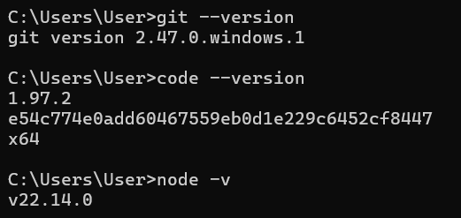
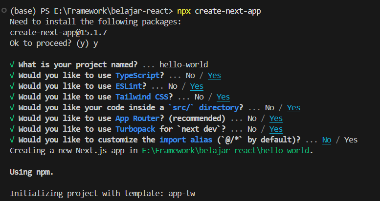
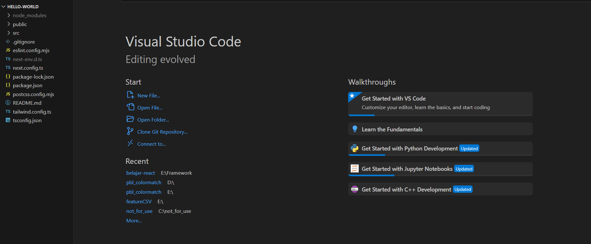
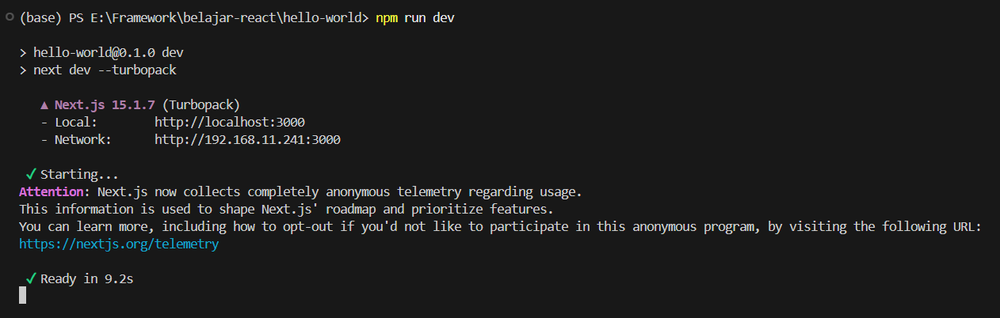
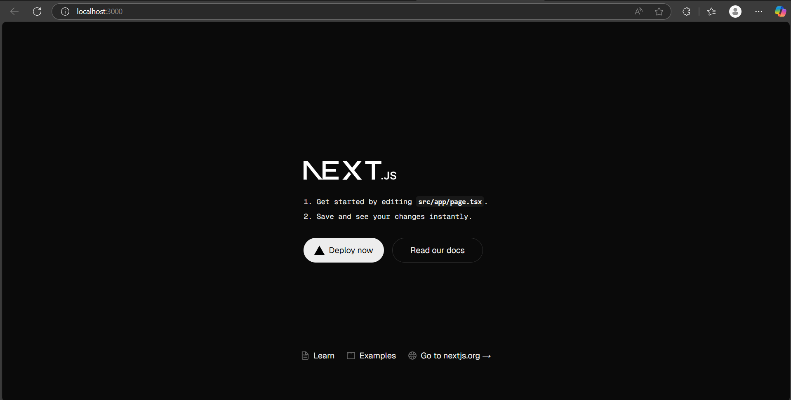
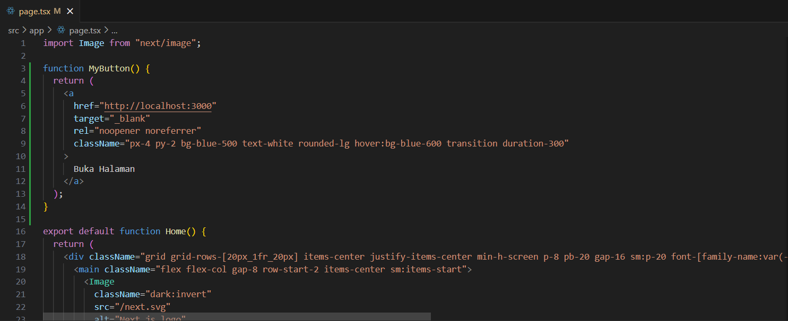
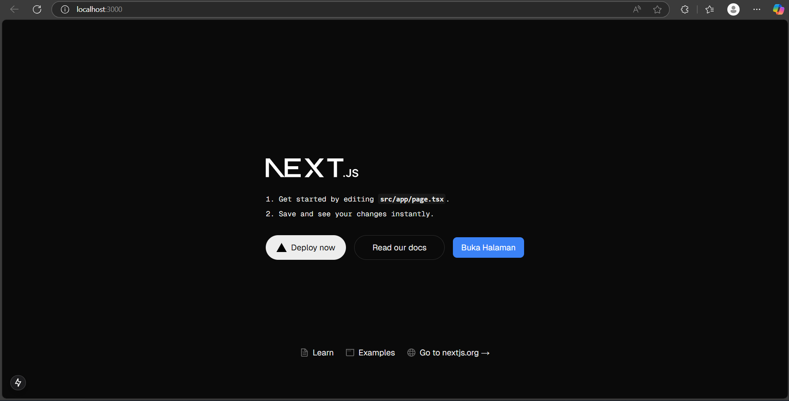
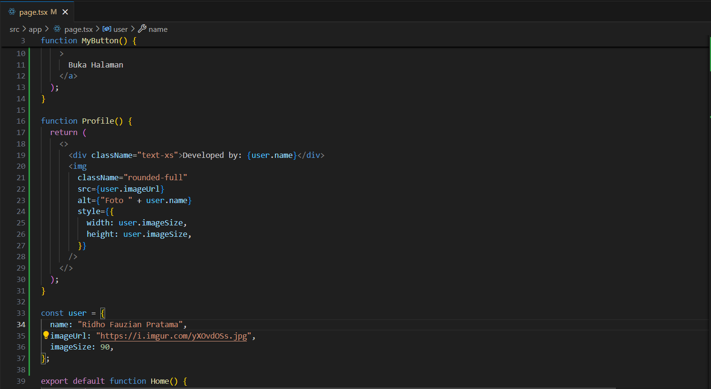
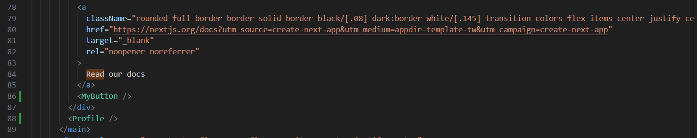
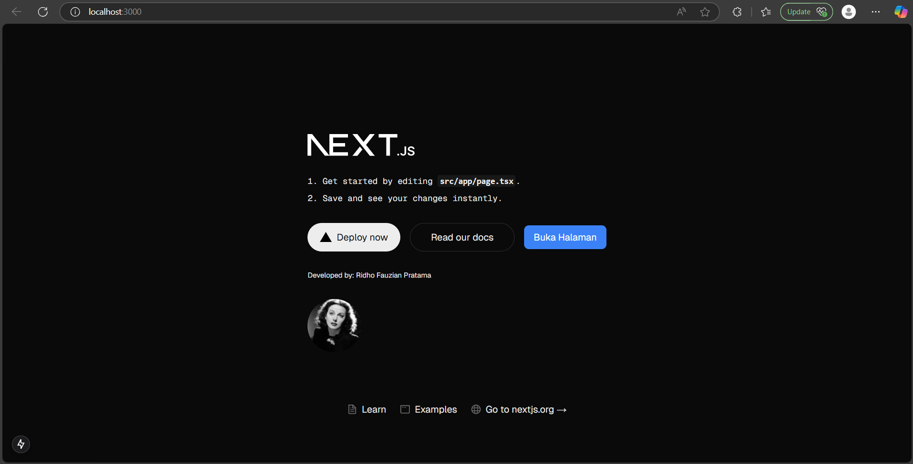

# Praktikum 1

## Instalasi Git, VS Code, Node.js

## Kegunaan Git, VS Code, Node.js 

### 1. Git    
- untuk melacak perubahan kode secara efisien.  
- Mengelola proyek dengan repositori lokal dan remote (GitHub, GitLab). 

### 2. VS Code (Visual Studio Code)    
- Menulis, mengedit, dan men-debug kode dengan fitur syntax highlighting dan IntelliSense.    

### 3. Node.js  
- Menjalankan aplikasi berbasis JavaScript, termasuk framework seperti **Next.js**  
- Menggunakan **npm (Node Package Manager)** untuk menginstal dan mengelola dependensi proyek.   

# Praktikum 2
## 1. Membuat folder proyek baru dengan nama belajar-react. Melalui konsol/command prompt/CMD masuk ke dalam folder tersebut dan jalankan perintah ini: npx create-next-app 

## 2. Buat proyek baru dengan nama hello-world seperti di bawah ini. Nama proyek ini perlu dimasukkan pertama kali melalui konsol. 

## 3. Buka folder proyek hello-world menggunakan VS Code. Masuk ke dalam folder proyek hello

## 4. Running proyek hello-world dengan memasukkan perintah di bawah ini melalui konsol atau terminal di dalam VS Code.

## Pertanyaan Praktikum 2 
### 1. Istilah dalam Next.js setelah Membuat Proyek Baru  

Saat membuat proyek baru menggunakan Next.js, beberapa istilah berikut muncul:  

#### - TypeScript  
  TypeScript adalah superset dari JavaScript yang menambahkan fitur **static typing** untuk meningkatkan keamanan dan kejelasan kode. Dalam Next.js, TypeScript digunakan untuk mencegah error dengan memberikan tipe pada variabel, fungsi, dan komponen.  

#### - ESLint  
  ESLint adalah alat untuk menganalisis dan menegakkan standar kode dalam JavaScript dan TypeScript. Dalam proyek Next.js, ESLint membantu mendeteksi dan memperbaiki kesalahan kode secara otomatis.  

#### - Tailwind CSS  
  Tailwind CSS adalah framework CSS berbasis utility-first yang memungkinkan pengembangan antarmuka pengguna lebih cepat dengan class langsung di dalam HTML atau JSX.  

#### - App Router  
  App Router adalah sistem routing terbaru di Next.js yang berbasis folder **`app/`**, menggantikan **`pages/`** dari sistem lama. Ini menggunakan konsep **server components** dan mendukung fitur seperti layout yang bersarang, streaming, dan parallel routes.  

#### - Import Alias  
  Import alias memungkinkan penggunaan path yang lebih pendek dalam impor modul dengan mendefinisikan alias di file "; // Alih-alih menggunakan relative path panjang

#### - Turbopack
Turbopack adalah bundler generasi terbaru yang digunakan oleh Next.js untuk meningkatkan kecepatan pengembangan. Dibangun dengan Rust, Turbopack lebih cepat dibandingkan Webpack dalam hot-reloading dan bundling kode.

### 2. Struktur Folder dan File dalam Proyek React (hello-world)
Setelah membuka proyek React hello-world di VS Code, struktur folder yang tampil memiliki fungsi :

#### - node_modules/
Folder ini berisi semua dependensi yang diunduh melalui npm atau yarn. Folder ini dikelola secara otomatis dan tidak perlu diedit secara manual.

#### - public/
Folder ini berisi aset statis seperti gambar, favicon, dan file statis lainnya yang bisa diakses oleh browser tanpa perlu diimpor ke dalam kode.

#### - src/
Folder utama tempat kode aplikasi React disimpan. Biasanya berisi:

src/App.js → Komponen utama React yang pertama kali dirender.
src/index.js → Entry point aplikasi yang merender App.js ke dalam DOM.
#### - .gitignore
File ini berisi daftar file atau folder yang tidak akan dilacak oleh Git, seperti node_modules/ dan file konfigurasi lingkungan .env.

#### - package.json
File utama untuk mengelola proyek React. Berisi informasi tentang proyek, dependensi, skrip, dan konfigurasi npm.

#### - package -lock.json
File ini mengunci versi dependensi agar proyek tetap stabil meskipun ada pembaruan pada package.json.

#### - README.md
Berisi dokumentasi dasar tentang proyek React yang dibuat.

# Praktikum 3
## 1. Di dalam folder proyek yang telah dibuka di VS Code, buka file page.tsx 

## 2. Tambahkan fungsi MyButton yang mengembalikan markup komponen button yang akan ditambahkan ke dalam webpage

## 3. Tambahkan komponen button tersebut di samping button Read Our Docs. 

# Praktikum 4
## 1. Tambahkan kode JSX di bawah ini ke dalam file page.tsx. 

## 2. Tambahkan komponen MyProfile setelah kompnen MyButton. 

