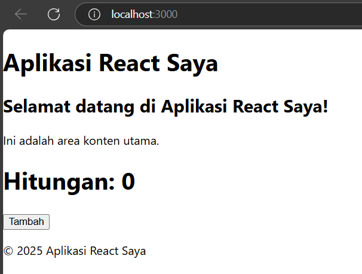
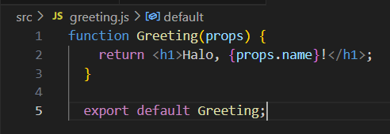
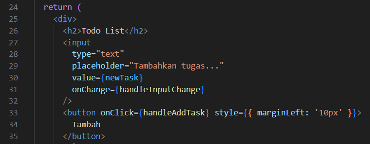

## Praktikum 1 :  Persiapan Lingkungan 

### Jalankan aplikasi React dengan perintah: npm start

## Praktikum 2 : Membuat Komponen React 

### 1. Buka file src/App.js di text editor Anda. 
### 2. Ganti kode di dalamnya dengan kode berikut untuk membuat komponen sederhana: 

### 3. Simpan file dan lihat perubahan di browser. Anda akan melihat tampilan sederhana dengan header, konten utama, dan footer.

## Praktikum 3 : Menggunakan JSX untuk Membuat Komponen Dinamis 

### 1. Buat file baru di direktori src dengan nama Counter.js. 
### 2. Tambahkan kode berikut untuk membuat komponen Counter yang dinamis:

### 3. Buka file src/App.js dan impor komponen Counter: 

### 4. Tambahkan komponen Counter ke dalam komponen App: 

### 5. Simpan file dan lihat perubahan di browser. Anda akan melihat tombol "Tambah" yang dapat meningkatkan hitungan saat diklik.

## Praktikum 4 : Menggunakan Props untuk Mengirim Data

### 1. Buat file baru di direktori src dengan nama Greeting.js. 
### 2. Tambahkan kode berikut untuk membuat komponen Greeting yang menerima props:

### 3. Buka file src/App.js dan impor komponen Greeting:

### 4. Tambahkan komponen Greeting ke dalam komponen App dan kirim props name:

### 5. Simpan file dan lihat perubahan di browser. Anda akan melihat pesan "Halo, John!" yang ditampilkan oleh komponen Greeting. 

## Praktikum 5 : Menggunakan State untuk Mengelola Data

### 1. Buka file src/App.js dan tambahkan kode berikut untuk membuat komponen yang mengelola state: 

### 2. Tambahkan komponen Example ke dalam komponen App: 

### 3. Simpan file dan lihat perubahan di browser. Anda akan melihat form input yang dapat mengupdate state dan menampilkan data yang dimasukkan. 

## Tugas

### 1. Buat komponen baru bernama TodoList yang menampilkan daftar tugas (todo list). Gunakan state untuk mengelola daftar tugas dan props untuk mengirim data tugas ke komponen anak. 

### 2. Tambahkan fitur untuk menambahkan tugas baru ke dalam daftar menggunakan form input.
- Menambahkan tugas baru ke daftar. 

- Form input untuk memasukkan tugas baru.

### 3. Implementasikan fitur untuk menghapus tugas dari daftar. 
- Fungsi menghapus tugas berdasarkan indeksnya.

- Tombol "Hapus"

- Menambahkan Tugas

- Menghapus Tugas
