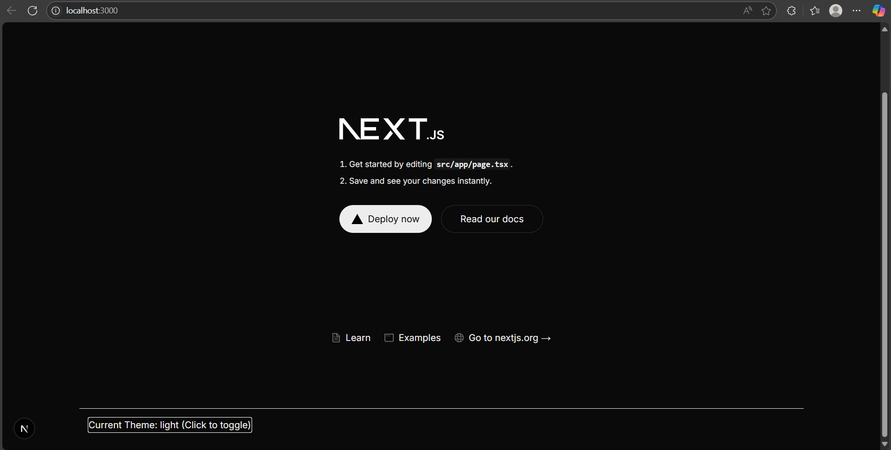
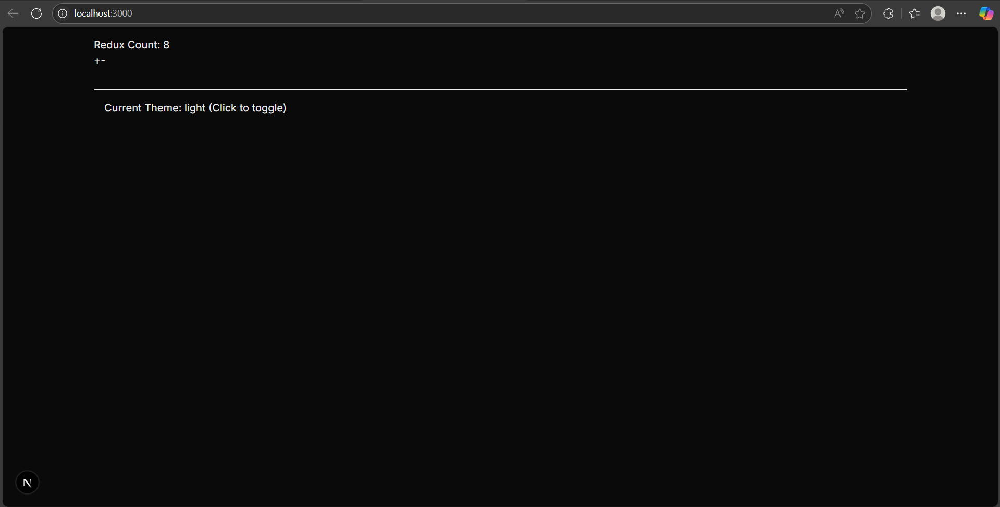
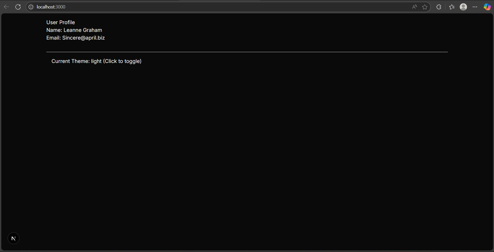
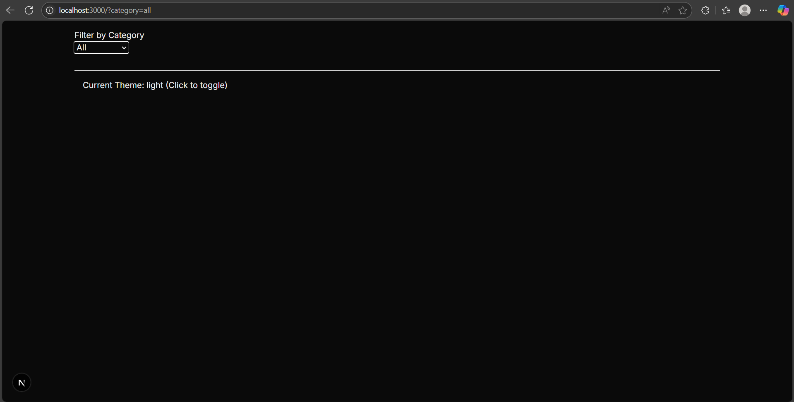
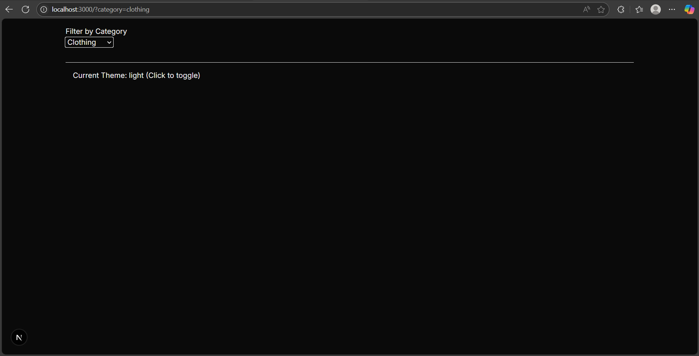

## Praktikum 1

## Praktikum 2

## Praktikum 3

## Praktikum 4

## Praktikum 5

## Tugas

### Soal
# 📊 Perbandingan Performa: Context API vs Zustand vs Redux

## 1. Tabel Perbandingan

| Fitur                          | Context API                          | Zustand                              | Redux                                 |
|-------------------------------|--------------------------------------|--------------------------------------|----------------------------------------|
| **Boilerplate**               | Minimal                              | Sangat minimal                       | Tinggi                                 |
| **Performa**                  | Kurang optimal (re-render global)    | Sangat cepat dan efisien             | Cukup cepat (dengan optimisasi)        |
| **Kemudahan Belajar**         | Mudah                                | Mudah                                | Menengah - Sulit                       |
| **Middleware Support**        | Tidak langsung tersedia              | Tersedia (built-in)                  | Lengkap (thunk, saga, dsb)             |
| **DevTools Support**          | Tidak                                | Terbatas                             | Lengkap                                |
| **Cocok untuk Skala**         | Kecil                                | Menengah hingga besar                | Besar dan kompleks                     |
| **Selector (update granular)**| Tidak ada                            | Ada                                  | Ada (reselect)                         |
| **Persist State**             | Manual                               | Built-in                             | Lewat middleware                       |
| **Async Logic**               | Manual (misal: useEffect)            | Native (async/await langsung)        | Lewat middleware (thunk, saga)         |

---

## 2. Kapan Sebaiknya Menggunakan?

### ✅ Context API
**Gunakan saat:**
- Proyek kecil atau sedang.
- Hanya butuh berbagi state sederhana seperti tema, bahasa, atau user session.
- Tidak banyak perubahan state.

**Hindari jika:**
- Banyak komponen yang bergantung pada state yang sering berubah (karena akan menyebabkan re-render yang luas).

---

### ✅ Zustand
**Gunakan saat:**
- Membutuhkan solusi state management yang simpel tapi powerfull.
- Ingin performa tinggi dengan granular updates.
- Proyek menengah atau besar tapi tidak butuh struktur kompleks Redux.
- Membutuhkan fitur seperti persist state dan async handler dengan mudah.

**Cocok untuk:**
- Aplikasi real-time
- Dashboard interaktif
- Game atau simulasi

---

### ✅ Redux
**Gunakan saat:**
- Proyek besar dan kompleks.
- Membutuhkan kontrol penuh atas alur data.
- Ingin manfaatkan fitur seperti time-travel debugging, logging, atau testing state yang kuat.
- Tim besar dengan kebutuhan standar kerja yang konsisten.

**Saran:** Gunakan **Redux Toolkit** untuk menghindari boilerplate berlebih.

---

## 📌 Kesimpulan

| Kebutuhan / Ukuran Proyek     | Rekomendasi        |
|-------------------------------|--------------------|
| Proyek kecil / state ringan   | ✅ Context API      |
| Proyek menengah / scalable    | ✅ Zustand          |
| Proyek besar / kompleks       | ✅ Redux Toolkit    |

---

